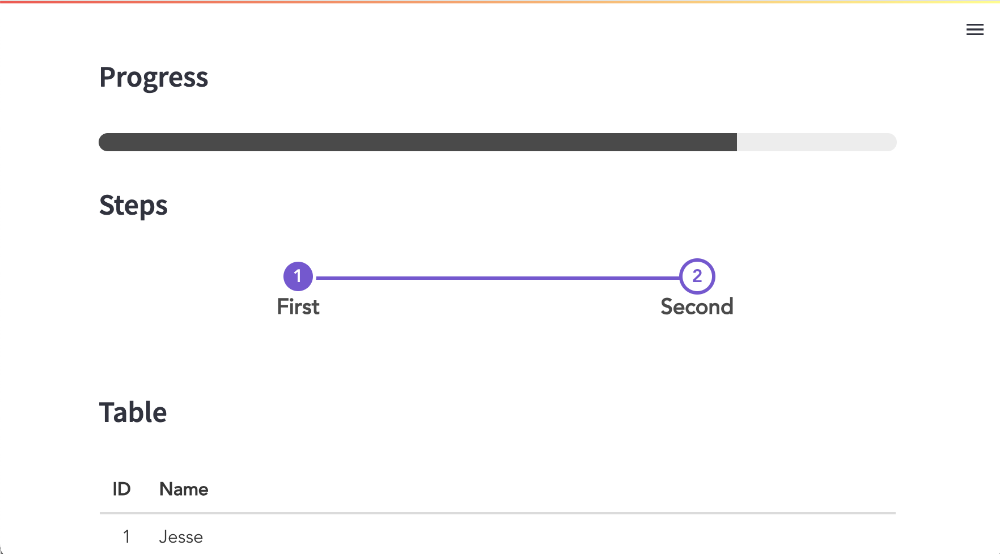
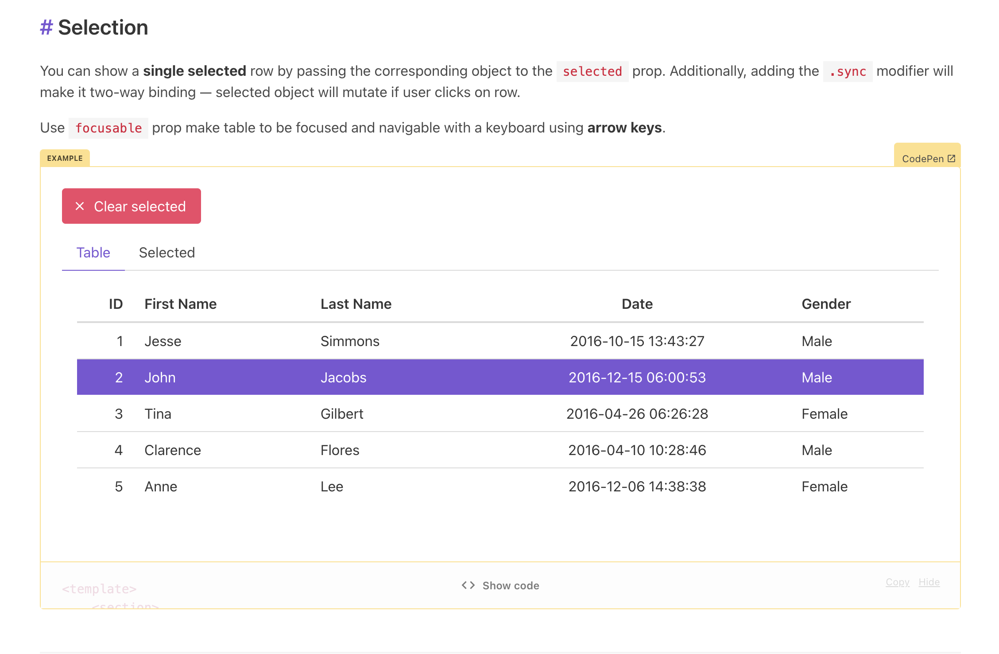
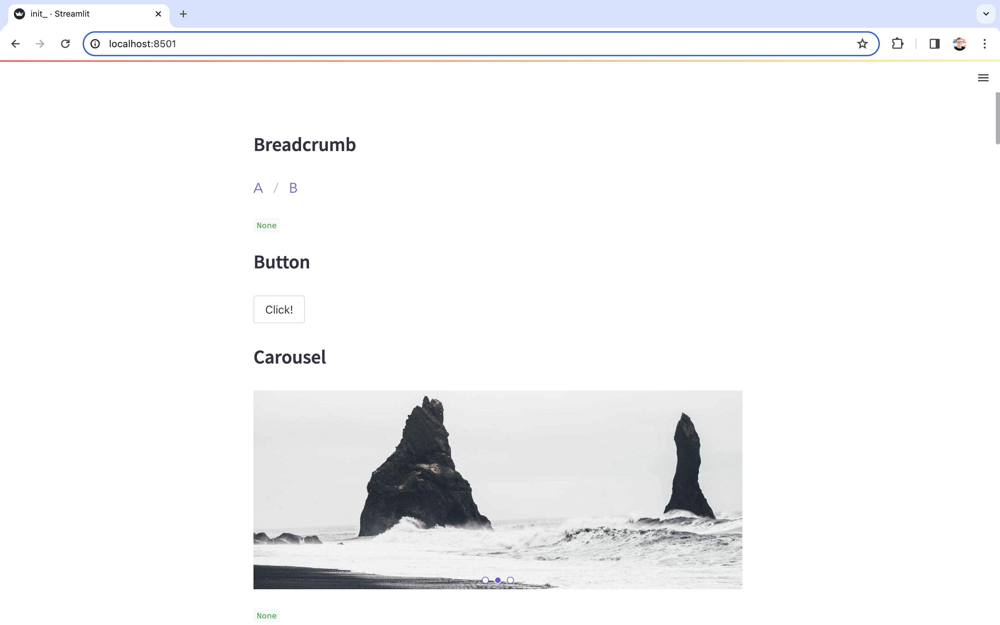

# Streamfy — Buefy for Streamlit

Modern frontend web components based on [Bulma](https://bulma.io/) and [Buefy](https://buefy.org/) for [Streamlit](https://streamlit.io/).

[](https://streamfy.streamlit.app/)

Live demo at [streamfy.streamlit.app](https://streamfy.streamlit.app/)

## Getting Started

Install `streamfy`:

```bash
pip install streamfy
```

Create a simple application `app.py`:

```py
import streamlit as st
import streamfy as sy

sy.carousel(items=[
  "https://picsum.photos/id/1051/1230/500",
  "https://picsum.photos/id/1052/1230/500",
  "https://picsum.photos/id/1053/1230/500",
])
```

Run this application:

```
streamlit run app.py
```


A file with all components is available in [examples/all.py](examples/all.py):



Take a look at [Buefy's documentation](https://buefy.org/documentation) for a list of all properties and examples available.

[](https://buefy.org/documentation)

## Contributing

Ensure you have [Python 3.6+](https://www.python.org/downloads/), [Node.js](https://nodejs.org), and [npm](https://docs.npmjs.com/downloading-and-installing-node-js-and-npm) installed.

Clone this repo and create a new Python virtual environment:

```
$ python3 -m venv venv  # create venv
$ . venv/bin/activate   # activate venv
$ pip install streamlit # install streamlit
```

Initialize and run the component frontend:

```
$ cd streamfy/frontend
$ npm install    # Install npm dependencies
$ npm run serve  # Start the Webpack dev server
```

From a separate terminal, run the Streamlit app:

```
$ . venv/bin/activate  # activate the venv you created earlier
$ streamlit run streamfy/__init__.py  # run the example
```

If all goes well, you should see something like this:



Modify the frontend code at `streamfy/frontend/src/Streamfy.vue` and the Python code at `streamfy/__init__.py`.

## Resources

- [Buefy Documentation](https://buefy.org/documentation/steps)
